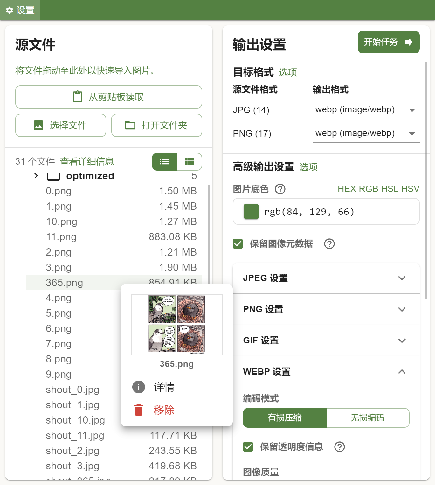
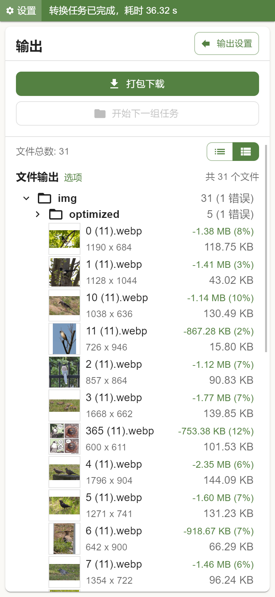

<p align="center">
    
</p>

# Owl Image Tools

A simple image conversion tool that runs in your browser, powered by [wasm-vibs](https://github.com/kleisauke/wasm-vips).

[Live Demo Here](https://img.mowl.cc/).

Language Support: `zh-CN`, `zh-TW` (via Google Translation), `en`.

<sub>If you've visited this page before, you will need to wait for the Service Worker to update itself before accessing to the newer version of the page (if any) since Service Worker will always serve the local cached version to you. Do a page refresh to check if the newer version is loaded. Or, terminate the service worker in the web app's settings page to remove cached data.</sub>

## Browser compatibility

Image processing engine requires WebAssembly SIMD support. For Safari, it's not available until iOS 16.4+.

Recommended: latest version of Google Chrome or Microsoft Edge.

Also works on: latest Firefox, Safari on iOS 16.4+.


## Intro

A experimental Web App built with React. No back-end. No analysis scripts. A pure client-side app.

(The screenshots were not the latest version, but the look is mostly the same)

<p>
    
    
</p>

All the image processing will be done done **locally** in your browser, thanks to the powerful [wasm-vibs](https://github.com/kleisauke/wasm-vips). It's currently based on wasm-vips 0.0.4 (vips version 8.13.3).

The code base is a bit messy and needs some optimization. Do it later (I guess).

## Features

- Runs in the browser, with PWA and Service Worker caching support (runs offline);
- Many convenient ways of importing files:
    - From Clipboard;
    - Drag and drop (file or folder);
        - <sub>Chromium-based browsers may limit the maximun entries to 100 for each directory. You'll see a notification if the app detected this;</sub>
    - Select files or directories (Desktop browsers only);
- Preview and compare output files if needed;
- Detailed help text for the options;
- Won't crash the page with large amount of images to process, if the browser supports File System Access API (or OPFS);
- Zip the output folders and download them (with [JSZip](https://stuk.github.io/jszip/));
- File list won't be laggy even with thousands of files.

## Notes

- It's recommended to use a browser that support Public File System Access (Chrome for example) in case the app runs into trouble before converting finished;
    - <sub>(since with the API support, files are written in your local directory immediately when one is finished. For browsers that doesn't support Public FS, you'll only be able to download manually on finished)</sub>
- For privateFS mode (browsers that only support OPFS), the files inside OPFS won't be deleted automatically if the app is closed with the output file list non-empty. You can clear them in the storage management dialog in the config menu.
    - This behavior may change in the future version.
    - In privateFS mode, app may not work as expected if OPFS is full.

## Build

This is a React project created with [Vite](https://vitejs.dev/).

```sh
npm install         # Install dependences
npm run dev         # Start Dev Server
npm run build       # Build
```

The Service Worker (`sw.js`) is generated with [Workbox](https://developer.chrome.com/docs/workbox/the-ways-of-workbox/). The config files are `workbox-config.cjs` for production build, and `workbox-config-dev.cjs` for development.

```sh
workbox generateSW workbox-config.cjs
```

## Known Issues

- When FS Mode is OPFS, the temp files will not be automatically cleaned up if the output file list is not manually cheared.

## TODOs

> <sub>or, never-to-be-done(s)</sub>

React context rework. Native react context makes rerendering heavily impact the performance.

UI rework and file tree view glitches fix.

A complete user interface rework is also required.

## License

MIT
